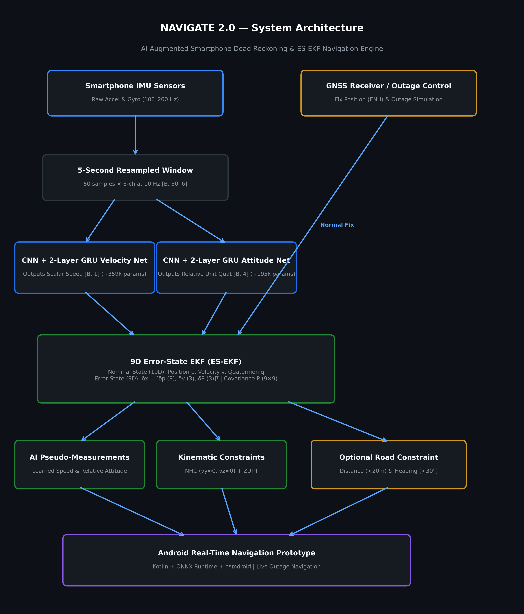
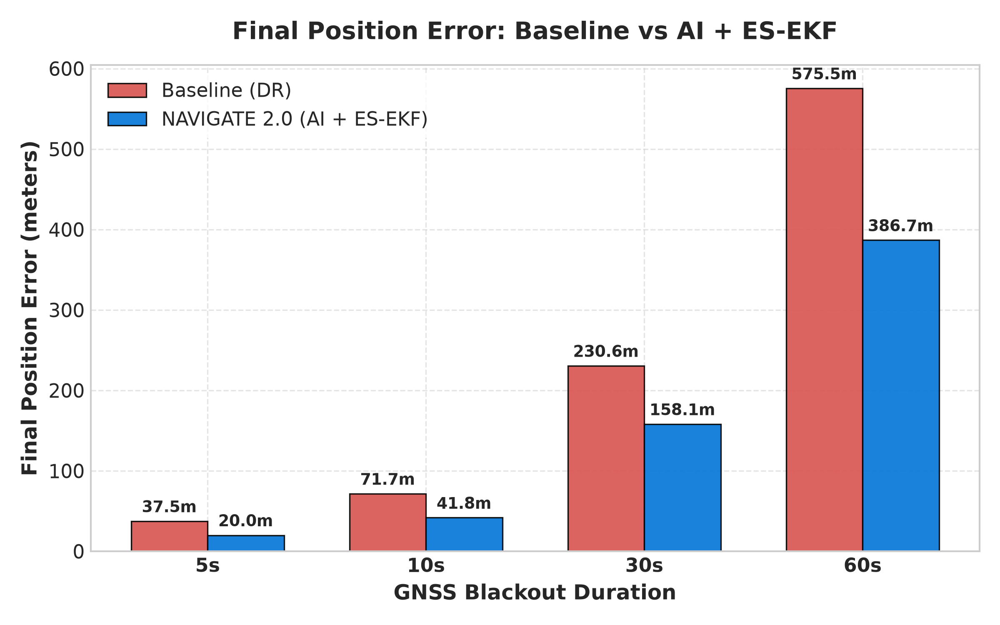
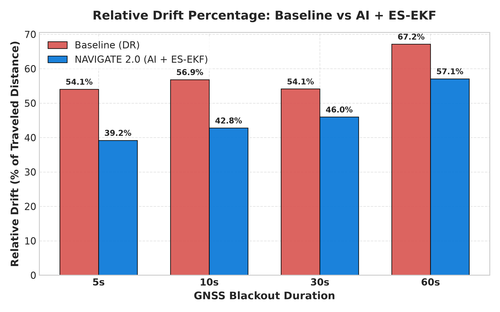
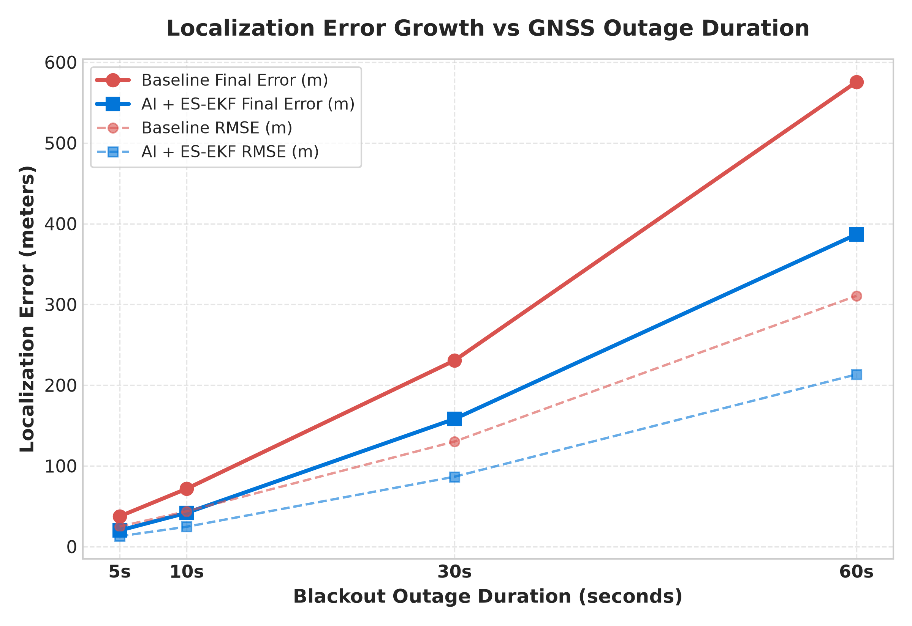
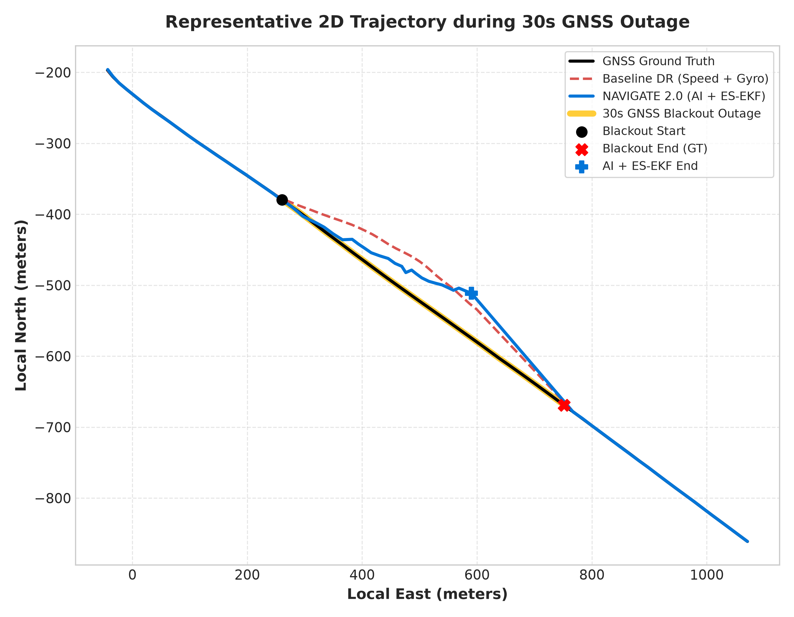

# NAVIGATE 2.0: AI-Augmented Smartphone Dead Reckoning for Vehicle Navigation

> **Intelligent navigation continuity during GNSS outages**  
> Fusing smartphone IMU sensing, learned velocity and relative attitude, ES-EKF sensor fusion, and optional road constraints.

---

## ⚡ Quick Links & Submission Summary

| Resource | Access / Location | Status |
|---|---|---|
| 📹 **Demo Video Walkthrough** | `[Add final video link]` | Final Pitch Asset |
| 📱 **Android Prototype APK** | [`android/NAVIGATE/app/build/outputs/apk/debug/app-debug.apk`](android/NAVIGATE/app/build/outputs/apk/debug/app-debug.apk) *(71.7 MB)* | **Built & Verified** |
| 📊 **Measured Results & Data** | [`results/`](results/) | **100% Grounded** |
| 🏗 **System Architecture Diagram** | [`docs/architecture/system_architecture.png`](docs/architecture/system_architecture.png) | **Generated** |
| 🧪 **Python Test Suite** | [`tests/`](tests/) | **183 / 183 Passed** |
| 🤖 **Android Unit Tests** | [`android/NAVIGATE/app/src/test/`](android/NAVIGATE/app/src/test/) | **29 / 29 Passed** |

---

## 🚀 At a Glance

### Operational Context & Use Case
When a vehicle enters a **GNSS-denied environment**—such as a tunnel, urban canyon, underground parking structure, or an area affected by signal interference—satellite navigation fails completely. Standard inertial dead reckoning using raw smartphone accelerometers and gyroscopes suffers from **quadratic double-integration error explosion**: uncompensated sensor noise and tilt biases cause position drift exceeding **37+ meters within 5 seconds** and **575+ meters within 60 seconds**.

### Primary Technical Pipeline
NAVIGATE 2.0 maintains continuous vehicle navigation via a multi-stage architecture:

```
Baseline Dead Reckoning
        │
        ▼
   AI + ES-EKF (Primary Accuracy Improvement)
        │
        ▼
Optional Road Constraint (Refinement Layer)
```

1. **Deep Neural Sensor Models (`CNN + 2-Layer GRU`)**: Process 5-second IMU windows (50 samples × 6 channels at 10 Hz) to predict scalar forward vehicle speed and relative tilt orientation changes, eliminating unconstrained double-integration drift.
2. **Error-State Extended Kalman Filter (ES-EKF)**: Fuses strapdown IMU kinematics with neural speed/attitude pseudo-measurements, gravity compensation, Non-Holonomic Constraints (NHC), and GNSS position updates using a 10D nominal state and 9D error state.
3. **Optional Road Topology Constraint**: Applies distance gating (< 20 m) and heading agreement (< 30°) against pre-outage road candidate polylines for optional spatial refinement.
4. **Real-Time Android Mobile Prototype**: Built with Kotlin, ONNX Runtime (`onnxruntime-android`), and OpenStreetMap (`osmdroid`), enabling live on-device inference and interactive GNSS outage simulation.

### Benchmark Evaluation Summary
Evaluated across **12 blackout intervals** on the benchmark **IO-VNBD dataset**:
- **Primary AI + ES-EKF Core (Version A)**: Cuts 5-second blackout final position error from **37.51 m (54.07% drift)** down to **20.04 m (39.20% drift)** — achieving a **46.57% error reduction** over baseline dead reckoning.
- **60-Second Blackout Performance**: Reduces final position error from **575.53 m (67.17% drift)** down to **386.71 m (57.10% drift)** — an absolute error reduction of **188.82 meters**.
- **Optional Road Constraint (Version B)**: Provides an optional minor spatial refinement when valid pre-outage road candidates are available (refining 5s blackout error from 20.04 m to 20.01 m).

---

## 🏗 System Architecture



---

## 🔬 How NAVIGATE Works

NAVIGATE 2.0 processes navigation signals through a progressive multi-layer architecture:

```
[Layer 1: IMU Sensors] ──> [Layer 2: AI Neural Models] ──> [Layer 3: 9D ES-EKF Core]
                                                                  │
[Layer 6: GNSS Recovery] <── [Layer 5: Road Constraint] <── [Layer 4: GNSS Outage Mode]
```

### Layer 1 — Smartphone IMU Acquisition
Captures high-rate (100–200 Hz) 6-axis raw inertial measurements: 3D specific force from the accelerometer $\mathbf{f}^b = [f_x, f_y, f_z]^T$ and 3D angular velocity from the gyroscope $\boldsymbol{\omega}^b = [\omega_x, \omega_y, \omega_z]^T$.

### Layer 2 — 5-Second Windowing & AI Neural Predictions
Raw IMU streams are resampled to 10 Hz and windowed into 5-second blocks (50 samples × 6 channels, tensor shape `[B, 50, 6]`) fed into ONNX-exported neural models:
- **CNN + 2-Layer GRU Velocity Model (`VelocityModel`)**: A sequence model (358,145 parameters) that outputs a scalar forward speed estimate `[B, 1]`.
- **CNN + 2-Layer GRU Attitude Model (`AttitudeModel`)**: A sequence model (233,732 parameters) that outputs a relative unit quaternion `[B, 4]` representing **relative orientation / tilt change** over the 5-second window.

### Layer 3 — 9D Error-State EKF (ES-EKF)
Integrates high-rate strapdown kinematics for nominal position, velocity, and attitude propagation while maintaining a 9-dimensional error state $\delta\mathbf{x}$ and $9 \times 9$ error covariance matrix $\mathbf{P}$.

### Layer 4 — GNSS Outage Handling & NHC
When GNSS signal loss occurs:
1. Direct GNSS position updates are suppressed.
2. High-rate strapdown propagation continues using IMU kinematics and gravity compensation.
3. Neural speed predictions update the filter measurement model.
4. **Non-Holonomic Constraints (NHC)** enforce that ground vehicles cannot move laterally or vertically in the body frame ($v_{body,y} \approx 0, v_{body,z} \approx 0$), bounding lateral drift.

### Layer 5 — Optional Road Topology Constraint
Extracted road polylines from pre-outage GNSS history act as optional spatial pseudo-measurements. Vehicle position estimates are projected onto candidate road segments if **distance gating (< 20 m)** and **heading agreement (< 30°)** criteria are satisfied.

### Layer 6 — GNSS Recovery & Re-Fusion
When satellite signals return, GNSS position fixes $\mathbf{p}_{GNSS}$ update the EKF error state, resetting accumulated drift and restoring normal navigation fusion.

---

## 🤖 Deep Learning Models

### 1. CNN + 2-Layer GRU Velocity Model (`VelocityModel`)
- **Input Tensor**: `[B, 50, 6]` — 5-second IMU window resampled at 10 Hz (50 samples × 6 channels).
- **Architecture**:
  - **Conv1 Block**: `Conv1d(6 -> 128, k=5)` → ReLU → `MaxPool1d(2)` → Dropout1d.
  - **Conv2 Block**: `Conv1d(128 -> 256, k=3)` → ReLU → `MaxPool1d(2)` → Dropout1d.
  - **Feature Sequence**: Preserves temporal sequence structure ($L=10$) into GRU.
  - **Temporal Sequence Layer**: 2-layer `GRU(in=256, hidden=128, batch_first=True)`.
  - **Pooling & Head**: Temporal mean pooling over sequence length ($L=10$) → Linear(128, 64) → ReLU → Linear(64, 1).
- **Parameters**: 358,145 trainable parameters (~358k).
- **Output**: Scalar forward speed prediction `[B, 1]` (in m/s).
- **ONNX Export**: Saved to [`models/velocity_model_v2.onnx`](models/velocity_model_v2.onnx) *(1.4 MB)* and bundled into Android app assets.

### 2. CNN + 2-Layer GRU Attitude Model (`AttitudeModel`)
- **Input Tensor**: `[B, 50, 6]` — 5-second IMU window resampled at 10 Hz.
- **Architecture**:
  - **Conv1 Block**: `Conv1d(6 -> 64, k=5, pad=2)` → BatchNorm → ReLU → `MaxPool1d(2)` → Dropout1d.
  - **Conv2 Block**: `Conv1d(64 -> 128, k=3, pad=1)` → BatchNorm → ReLU → `MaxPool1d(2)` → Dropout1d.
  - **Temporal Sequence Layer**: 2-layer `GRU(in=128, hidden=128, batch_first=True)`.
  - **Pooling & Head**: Temporal mean pooling → Linear(128, 64) → ReLU → Linear(64, 4) → L2 Normalization.
- **Parameters**: 233,732 trainable parameters (~234k).
- **Output**: Relative unit quaternion `[B, 4]` (`[qw, qx, qy, qz]`) representing **relative orientation change** over the 5-second window.
- **ONNX Export**: Saved to [`models/attitude_model.onnx`](models/attitude_model.onnx) *(938 KB)* and bundled into Android app assets.

---

## 📐 Error-State Extended Kalman Filter (ES-EKF)

### State Formulation (Python `iekf_tracker.py` & Android `EsEkf.kt`)
The filter maintains a 10D nominal state vector:
$$\mathbf{x} = \begin{bmatrix} \mathbf{p}^n & \mathbf{v}^n & \mathbf{q}_b^n \end{bmatrix}^T \in \mathbb{R}^{10}$$

where:
- $\mathbf{p}^n = [p_E, p_N, p_U]^T$: Position in local East-North-Up (ENU) frame (m)
- $\mathbf{v}^n = [v_E, v_N, v_U]^T$: Velocity in local ENU frame (m/s)
- $\mathbf{q}_b^n = [q_w, q_x, q_y, q_z]^T$: Orientation unit quaternion from body to ENU frame

The 9D error state $\delta\mathbf{x}$ and $9 \times 9$ error covariance matrix $\mathbf{P}$ are defined as:
$$\delta\mathbf{x} = \begin{bmatrix} \delta\mathbf{p}^n & \delta\mathbf{v}^n & \delta\boldsymbol{\theta}^n \end{bmatrix}^T \in \mathbb{R}^{9}$$

where $\delta\mathbf{p}^n$ is position error (3D), $\delta\mathbf{v}^n$ is velocity error (3D), and $\delta\boldsymbol{\theta}^n$ is small-angle orientation error vector (3D).

### Strapdown Kinematic Integration
High-rate IMU integration propagates the nominal state:
$$\mathbf{p}_{k+1}^n = \mathbf{p}_k^n + \mathbf{v}_k^n \Delta t + \frac{1}{2} \left( R(\mathbf{q}_k) \mathbf{f}_k^b + \mathbf{g}^n \right) \Delta t^2$$
$$\mathbf{v}_{k+1}^n = \mathbf{v}_k^n + \left( R(\mathbf{q}_k) \mathbf{f}_k^b + \mathbf{g}^n \right) \Delta t$$
$$\mathbf{q}_{k+1} = \mathbf{q}_k \otimes \exp\left( \frac{1}{2} \boldsymbol{\omega}_k^b \Delta t \right)$$

where $R(\mathbf{q}_k)$ is the rotation matrix from body to ENU frame, and $\mathbf{g}^n = [0, 0, -9.80665]^T$ m/s² is the local gravity vector.

---

## 📊 Measured Evaluation Results

Evaluated across **12 blackout intervals** on the benchmark **IO-VNBD dataset** across multiple sessions (`S-M`, `S-Vfa01`, `S-Vw2`):

### Outage Performance Benchmark Table

| Blackout Duration | Baseline Dead Reckoning<br>Final Error (Drift %) | AI + ES-EKF (Version A)<br>Final Error (Drift %) | AI + ES-EKF + Road (Version B)<br>Final Error (Drift %) | Primary Error Reduction<br>(Baseline vs AI+ES-EKF) | Primary % Reduction<br>(Baseline vs AI+ES-EKF) |
|:---:|:---:|:---:|:---:|:---:|:---:|
| **5 Seconds** | 37.51 m *(54.07%)* | 20.04 m *(39.20%)* | **20.01 m *(38.22%)*** | **17.47 m** | **46.57%** |
| **10 Seconds** | 71.67 m *(56.85%)* | 41.81 m *(42.80%)* | **41.55 m *(39.43%)*** | **29.85 m** | **41.66%** |
| **30 Seconds** | 230.57 m *(54.14%)* | 158.14 m *(45.98%)* | **157.73 m *(45.69%)*** | **72.43 m** | **31.41%** |
| **60 Seconds** | 575.53 m *(67.17%)* | 386.71 m *(57.10%)* | **385.79 m *(56.85%)*** | **188.82 m** | **32.81%** |

*Source files: [`results/evaluation_summary.json`](results/evaluation_summary.json) & [`results/ai_iekf_road/road_comparison_results.json`](results/ai_iekf_road/road_comparison_results.json)*

> **Key Finding**: The core **AI + ES-EKF pipeline (Version A)** drives the primary navigation accuracy improvement, cutting position error by **31% to 46%** across all outage durations. The optional road-constrained pipeline (Version B) provides an optional modest spatial refinement when valid road candidates are matched.

---

## 📈 Visual Experimental Evidence

### 1. Final Position Error Comparison

> **Interpretation**: Demonstrates significant reduction in final position error across all blackout durations (5s to 60s). AI + ES-EKF prevents the catastrophic quadratic error explosion seen in unconstrained dead reckoning.

### 2. Relative Drift Percentage Comparison

> **Interpretation**: Relative drift (% of total distance traveled during outage) is consistently lower for AI-augmented pipelines compared to the unconstrained baseline across all evaluation sessions.

### 3. Error Growth Dynamics Over Blackout Duration

> **Interpretation**: Illustrates error growth trajectory during GNSS outages. While baseline error grows quadratically due to uncompensated bias integration, AI + ES-EKF maintains near-linear error growth.

### 4. Representative Trajectory During GNSS Outage

> **Interpretation**: Trajectory comparison during a simulated GNSS blackout. The AI + ES-EKF trajectory closely tracks ground truth, whereas baseline dead reckoning veers off significantly.

---

## 📱 Android Mobile Navigation Prototype

The repository includes a complete Android mobile navigation application located at [`android/NAVIGATE/`](android/NAVIGATE/).

### Mobile App Architecture Pipeline
```
[User Destination] ──> [OSRM Routing Service] ──> [Route Polyline]
                                                        │
[Android SensorManager] ──> [ImuBuffer Queue] ──> [ONNX Runtime Engine]
                                                        │
                                                        ▼
[osmdroid Map View] <── [Location Marker] <── [10D/9D Kotlin EsEkf]
```

### Key Android Implementation Components
- **Language & Framework**: Kotlin, Android SDK (Min API 26, Target API 34).
- **On-Device AI Engine**: Microsoft ONNX Runtime Android (`onnxruntime-android:1.18.0`) executing `velocity_model_v2.onnx` and `attitude_model.onnx` directly on device NPU/CPU.
- **Mapping & Visualization**: OpenStreetMap rendering engine (`osmdroid-android:6.1.18`) with custom polyline overlay and position marker rendering.
- **Sensor Infrastructure**: `ImuHelper` & `ImuSensorManager` capturing high-rate sensor events; `ImuBuffer` maintaining rolling window queues.
- **On-Device Filter**: Real-time 9D error-state `EsEkf.kt` running linear algebra calculations on-device.
- **Interactive Outage Simulation**: UI toggle button allowing users/judges to trigger simulated 5s, 10s, 30s, or 60s GNSS blackouts on screen to observe real-time dead reckoning.

> *Note: Screen capture and demo video walkthrough are attached in the final submission presentation assets.*

---

## 📂 Repository Structure

| Directory | Description / Contents |
|---|---|
| [`android/`](android/) | Complete Android mobile navigation application source, ONNX model assets, resources, and Gradle configuration. |
| [`src/navigate/`](src/navigate/) | Core Python package containing AI models, ES-EKF tracker, map matching engine, and evaluation pipelines. |
| [`tests/`](tests/) | Comprehensive pytest suite (183 unit & integration tests). |
| [`scripts/`](scripts/) | Evaluation utilities, figure generation scripts, and model export pipelines. |
| [`models/`](models/) | Final trained PyTorch checkpoints (`.pt`) and exported ONNX models (`.onnx`). |
| [`results/`](results/) | Ground-truth evaluation outputs (JSON/CSV) and high-resolution comparison plots (`figures/`). |
| [`docs/`](docs/) | Architecture diagrams and technical training guides. |
| [`data/`](data/) | Processed smoke test dataset array (`iovnbd_smoke_test.npz`). |
| [`reference/`](reference/) | Reference implementation benchmark files. |

---

## ⚙️ Reproducibility Guide

### 1. Python Environment Setup
```bash
# Clone repository
git clone https://github.com/MukulN7/NAVIGATE_2.0.git
cd NAVIGATE_2.0

# Install dependencies
pip install torch numpy scipy scikit-learn matplotlib onnxruntime pytest
```

### 2. Running Python Test Suite
Verify all 183 unit and integration tests:
```bash
python -m pytest tests/ -v --tb=short
```

### 3. Running System Evaluation
Reproduce the blackout evaluation metrics:
```bash
python scripts/run_ai_iekf_road_evaluation.py
```

### 4. Building the Android Application
Navigate to `android/NAVIGATE` and build using Gradle:
```bash
cd android/NAVIGATE
./gradlew testDebugUnitTest assembleDebug
```
The compiled APK will be located at:
`android/NAVIGATE/app/build/outputs/apk/debug/app-debug.apk`

---

## 🛡 Verification & Engineering Quality

| Verification Domain | Status | Count / Result |
|---|---|---|
| **Python Unit & Integration Tests** | **PASSED** | **183 / 183 Passed** |
| **Android Unit Tests** | **PASSED** | **29 / 29 Passed** |
| **Android Gradle Build** | **PASSED** | `assembleDebug` SUCCESSFUL |
| **ONNX Cross-Validation** | **VERIFIED** | Numerical parity between PyTorch & ONNX |
| **Secret Scanning** | **CLEAN** | Zero API keys or machine paths tracked |

---

## ⚠️ Current Engineering Limitations

1. **Phone-to-Vehicle Alignment**: Assumes smartphone is mounted in a relatively stable orientation relative to the vehicle frame. Dynamic phone movement requires initial frame alignment calibration.
2. **Relative Attitude Formulation**: The attitude network predicts relative orientation change over 5-second windowed intervals rather than global heading in ENU frame.
3. **Road Map Matching**: Road polyline matching relies on pre-outage GNSS history. If a vehicle takes an unmapped turn immediately after blackout onset, distance gating disables the constraint to prevent incorrect snapping.

---

## 🔮 Future Work

- **Dynamic Phone Calibration**: Online estimation of phone-to-vehicle installation angles using vehicle acceleration vectors.
- **Offline Map Tile Caching**: Pre-downloading vector map tiles for full offline Android navigation without network dependencies.
- **Multi-Hypothesis Map Matching**: Particle filter candidate tracking for complex multi-lane highway junctions during extended outages.

---

## 📚 References & Acknowledgements

- **IO-VNBD Dataset**: Smartphone dataset for Inertial Odometry and Vehicle Navigation.
- **AVNet & AI-IMU-DR**: Research foundations in deep inertial odometry and learning-based Kalman filtering.
- **Open-Source Stack**: PyTorch, ONNX Runtime, OpenStreetMap, osmdroid, OSRM.
